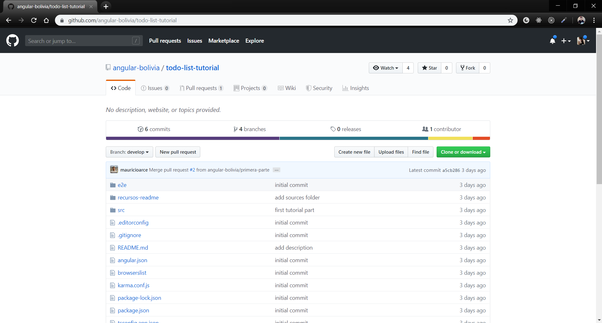

# Tutorial Lista de Tareas - ngGirls Bolivia

En este tutorial, te llevaremos de viaje a las entrañas de la tecnología web, para que veas todas las piezas que se necesitan para construir una web funcional.

Como pasa con todas las cosas nuevas va a ser una aventura, diviértete, una vez que te has decidido a empezar, te va a ir fenomenal :)

## Primera parte

Puedes encontrar la primera parte de este tutorial [aquí](https://ng-girls-bolivia.gitbook.io/workshop/).

## Tercera Parte: Instalación del entorno

Ya tenemos nuestro proyecto creado, pero si deseamos acceder a él debemos tener una conexión a internet. Es en ese momento donde nos preguntamos cómo crear nuestros proyectos sin la necesidad de stackblitz. La solución es Node.js y Angular CLI.

## ¿Node.js y Angular CLI?

Node.js es un "entorno de ejecución para JavaScript", es decir para ejecutar JavaScript los desarrolladores necesitaban siempre un navegador como Chrome, Firefox entre otros, pero Node.js nos ofrece poderlo ejecutar por ejemplo en un servidor o en tu misma computadora. Cuando descargamos Node.js en nuestro ordenador viene con un gestor de paquetes llamado NPM (Node Package Manager) el cual te permite descargar librerías en cualquier proyecto Javascript.

Angular CLI  es una librería JavaScript, su nombre viene de la siglas Command Line Interface (Interfaz de línea de comandos), es decir, usaremos la consola para generar y construir los proyectos Angular.

> No le temas a la consola a medida con el tiempo tendras mas confiansa y entenderas todos los mensajes en blanco y negro que te apareceran

Como lo mencianamos anteriormente node nos permite descargar liberias una de ellas es Angular CLI entonces procederemos a la instalacion 

## Instalacion de Node.js

El primer paso para instalar angular en nuestro entorno es poder instalar Node.

## Paso 1
debemos ir a la pagina de Node.js: [pagina de node](https://nodejs.org/es/) y le daremos click en descargar la ultima version

## Paso 2
Se nos descargara un ejecutable, le daremos click,en todos los pasos siguiente y ya estara listo

## Paso 3
Para verificar si se instalo correctamente debemos abrir la consola y escribir 

> node --version 

te deberia salir la version que decia en la pagina cuando descargaste

## Instalacion de @angular/cli
en la consola escribiremos el siguiente comando en nuestra consola, la cual servira para instalar a nivel global angular en nuestros ordenadores

> npm install -g @angular/cli

# instalacion de Visual studio Code
una manera increible de programar es teniendo VS code, es un editor de texto muy potente el cual nos servira para poder programar en muchos lenguajes de programacion, pero este programa es preferido por los desarrolladores web.

Para la instalacion iremos a la [pagina oficial de VS Code](code.visualstudio.com) y le daremos en descargar

instalaremos como cualquier programa

# es momento de reiniciar tu computador
es buena idea reiniciar tu computador

## Descargando nuestro proyecto

## paso 1
para descargar nuestro proyecto debemos ir a la [pagina](https://github.com/angular-bolivia/todo-list-tutorial.git)

## paso 2 
le daremos click en el boton verde "clone or download" Download zip

## paso 3
se descargara un zip, lo pondremos en una carpeta de tu preferencia y por ultimo lo descomprimimos
## paso 4
una vez descomprimido debemos entrar con la consola en el directorio
[si deseas saber mas informacion acerca de comandos de consola](http://www.falconmasters.com/offtopic/como-utilizar-consola-de-windows/) por ejemplo mi proyecto esta en mi escritorio ire con este comando:

> cd C:\Users\ **$tu-usuario** \Desktop\todo-list-tutorial
## paso 5
por ultimo escribiremos el comando, este proceso puede tardar varios minutos, puedes tomar un descanso!
> npm install

## paso 6
Usaremos VS code por lo tanto escribiremos el comando 
> code .

Automáticamente se abrirá en Visual Studio Code, pero deseamos abrirlo en el navegado, así que escribiremos este comando en la consola:

> ng serve -o 

este comando le esta diciendo que cree un servidor local en nuestro ordenador y el signo **-o** indica que cuando nuestro servidor este listo abra automaticamente el navegador, **ten paciencia puede demorar.**

# Felicidades lo lograste!!
