# Tutorial Lista de Tareas - ngGirls Bolivia

En este tutorial, te llevaremos de viaje a las entrañas de la tecnología web, para que veas todas las piezas que se necesitan para construir una web funcional.

Como pasa con todas las cosas nuevas va a ser una aventura, diviértete, una vez que te has decidido a empezar, te va a ir fenomenal :)

## Primera parte: crear todo list

Puedes encontrar la primera parte de este tutorial [aquí](https://ng-girls-bolivia.gitbook.io/workshop/).

## Segunda parte: eliminar y editar tareas

Ahora que sabemos crear Tareas llego la hora de eliminar y editar una tarea ya creada.

- Paso 1: Primeramente necesitamos crear una clase llamada tarea, para esto vamos a crear un archivo llamado tarea.model.ts que contendrá nuestra clase Tarea,
  esta clase tendrá dos atributos `detalle` que será de tipo string y `completada` que será de tipo boolean, esta clase también tendrá su función `constructor()`
  con los datos mencionados anteriormente.

  Ejemplo de la clase:

  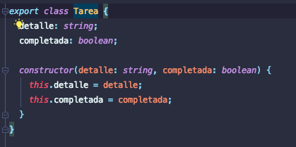

- Paso 2: Ahora toca modificar el archivo app.component.ts para que pueda funcionar con nuestra nueva clase, esta modificación consta de
  los siguientes pasos.

- Paso 2.1: Importar nuestra clase Tarea

  `import { Tarea } from './tarea.model';`

- Paso 2.2: Cambiar el tipo de dato de listaTareas de una lista de Strings a una lista de tareas `listaTareas: Tarea[] = [];`.

- Paso 2.3: Ahora que listaTareas es una lista de Tareas debemos modificar la función `crearTarea()`.

  - Dentro de la función creamos una variable de tipo Tarea que recibirá como parámetros de creación la variable `nuevaTarea` para el campo
    detalle y `false` en el campo completada del constructor.
  - Una vez creada la tarea esta se añadirá a `listaTarea` con la función `push`.
  - Finalmente cambiamos el valor de la variable `nuevaTarea` a `''`.

Ejemplo:

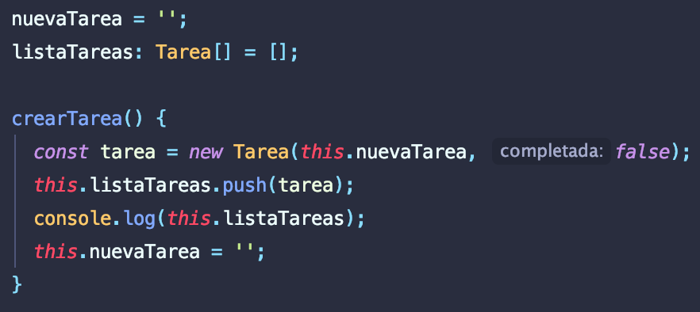

- Paso 2.4: Crearemos nuestra función para eliminar una tarea, esta función recibirá como parámetro el índice de la tarea que queremos eliminar
  y con la función `splice` de `listaTarea` eliminaremos la tarea de la lista.

  Si deseas conocer mas de la funcion splice podras encontrar la informacion [aquí](https://developer.mozilla.org/es/docs/Web/JavaScript/Referencia/Objetos_globales/Array/splice).

  Ejemplo:

  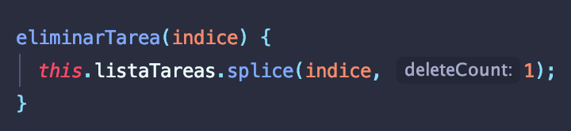

- Paso 2.5: Crearemos la función para cambiar el valor del atributo `completada` de una tarea, esta función recibe como parámetro la tarea que queremos actualizar
  y le diremos que el atributo `completada` de la tarea será igual al opuesto del valor actual del atributo `completada`.

  Ejemplo:

  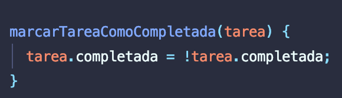

- Paso 3: Ahora vamos a editar los archivos app.component.css y styles.css en ellos agregaremos los estilos que necesita nuestro componente para poder visualizarse correctamente.

  - app.componente.css

    Aqui añadiremos los siguientes estilos:

    - Estilo de cada tarea `todo-item`
      - Estilo de una tarea completada `tarea=completada`
      - Estilo del texto de una tarea `todo-title`
      - Estilo del caja de actualización de la tarea `todo-checkbox`

        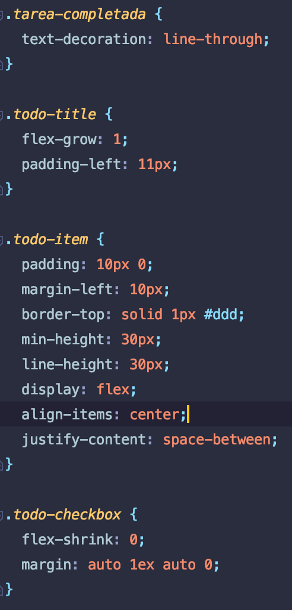

- styles.css
  Aquí añadiremos los estilos de nuestro botón de borrado.

  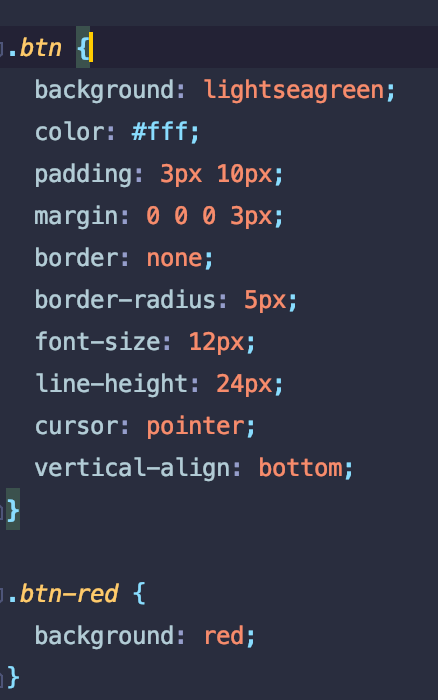

- Paso 4: Por último editaremos el archivo app.component.html, esta modificación consta de los siguientes pasos:

  - Paso 4.1: en ngFor añadiremos añadiremos el código para obtener el índice de cada tarea.

    `<li *ngFor="let tarea of listaTareas; index as indice">`

  - Paso 4.2 Ahora en el lugar del `<label>` donde estaba nuestra tarea pondremos un `

` con el class `todo-item` creado anteriormente
    y dentro contendrá lo siguiente:
    - Un input de tipo `checkbox`, como class tendrá nuestro class `todo-checkbox` y como click el método `marcarTareaComoCompletada(tarea)`.
    - Un `` que tendrá un ngClass que verificará si el atributo `completada` es `true` o `false`, de ser `true` tendrá la class
      `tarea-completada`, además también tendrá la class `todo-title` y por último mostrara el atributo `detalle` de la tarea.
    - Crearemos un `<label></label>` que contendrá un `<button></button>` con el texto Eliminar, la class `btn` y `btn-red` y por último el click
      `eliminarTarea(indice)`

  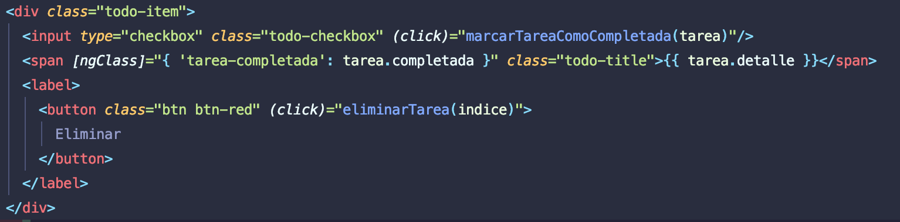

  y Finalmente el resultado será el siguiente

  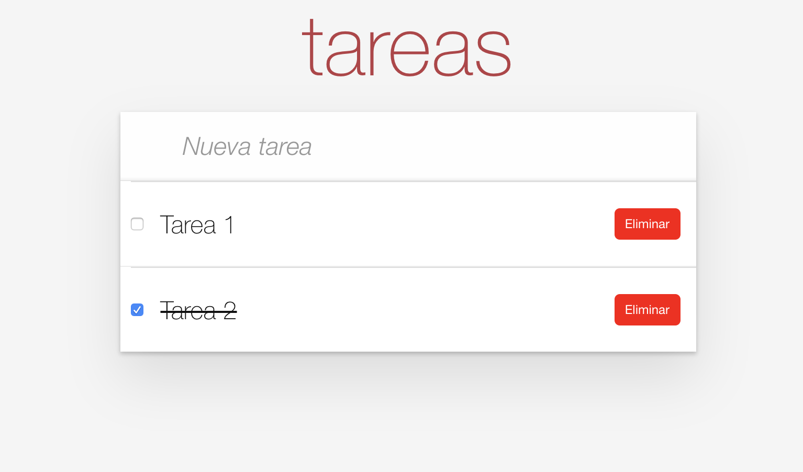

## Tercera parte: instalación del entorno

Ya tenemos nuestro proyecto creado, pero si deseamos acceder a él debemos tener una conexión a internet. Es en ese momento donde nos preguntamos cómo crear nuestros proyectos sin la necesidad de stackblitz. La solución es Node.js y Angular CLI.

## ¿Node.js y Angular CLI?

Node.js es un "entorno de ejecución para JavaScript", es decir para ejecutar JavaScript los desarrolladores necesitaban siempre un navegador como Chrome, Firefox entre otros, pero Node.js nos ofrece poderlo ejecutar por ejemplo en un servidor o en tu misma computadora. Cuando descargamos Node.js en nuestro ordenador viene con un gestor de paquetes llamado NPM (Node Package Manager) el cual te permite descargar librerias en cualquier proyecto Javascript.

Angular CLI es una librería JavaScript, su nombre viene de la siglas Command Line Interface (Interfaz de línea de comandos), es decir, usaremos la consola para generar y construir los proyectos Angular.

> No le temas a la consola, a medida que pase el tiempo tendrás más confianza y entenderás todos los mensajes en blanco y negro que te aparecerán.

Como lo mencionamos anteriormente, Node.js nos permite descargar librerías. Una de ellas es Angular CLI, entonces procederemos a la instalación.

## Instalación de Node.js

El primer paso para instalar Angular en nuestro entorno es poder instalar Node.js.

- Paso 1: Debemos ir a la pagina de Node.js: [pagina de node](https://nodejs.org/es/) y le daremos click en descargar la última versión.

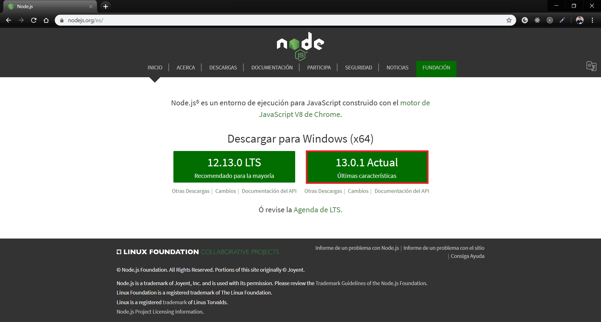

- Paso 2: Se nos descargará un **ejecutable**, lo abriremos, en todos los pasos hacemos click en "siguiente" y ya estará listo.

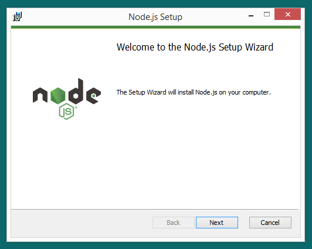
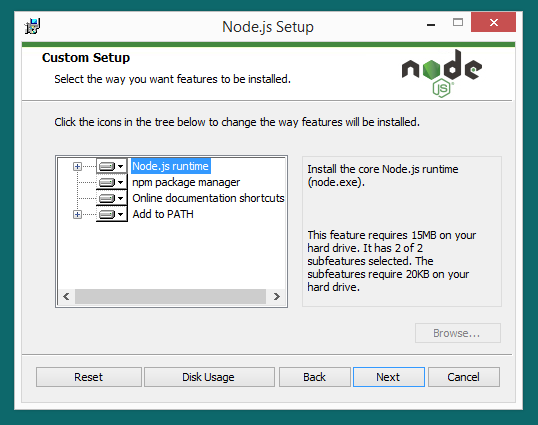

- Paso 3: Para verificar si se instaló correctamente debemos abrir la consola y escribir:

> node --version

Debería salir la versión que decía en la página cuando descargamos.

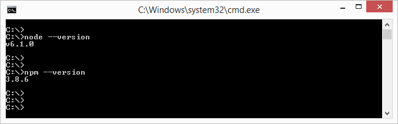

## Instalación de Angular CLI

En la consola escribiremos el siguiente comando, el cual servirá para instalar a nivel global Angular en nuestros ordenadores.

> npm install -g @angular/cli

## Instalación de Visual Studio Code

Una manera increíble de programar es teniendo VS Code. Es un editor de texto muy potente el cual nos servirá para poder programar en muchos lenguajes de programación. Este programa es muy popular entre los desarrolladores web.

Para la instalación iremos a la [página oficial de VS Code](code.visualstudio.com) y le daremos en descargar.

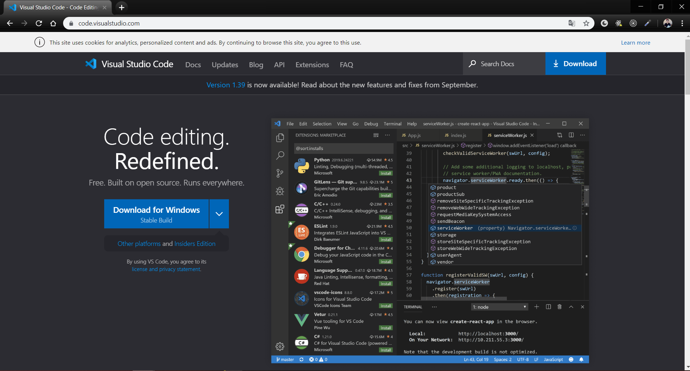

Instalaremos como cualquier otro programa.

## Descargando nuestro proyecto

- Paso 1: Para descargar nuestro proyecto debemos ir a la [página](https://github.com/angular-boliv..git).

- Paso 2: Le daremos click en el botón verde "Clone or download" y luego "Download ZIP".
  

- Paso 3: Se descargará un ZIP, lo pondremos en la carpeta de tu preferencia y por último lo descomprimimos.
- Paso 4: Una vez descomprimido debemos entrar con la consola en el directorio del proyecto.
  [Si deseas saber más acerca de comandos de consola](http://www.falconmasters.com/offtopic/como-utilizar-consola-de-windows/). Por ejemplo, mi proyecto está en mi escritorio, iré con este comando:

> cd C:\Users\ **\$tu-usuario** \Deskt.

- Paso 5 Por último escribiremos el comando de instalación. Este proceso puede tardar varios minutos ¡Puedes tomar un descanso!

  > npm install

- Paso 6: Usaremos VS Code, por lo tanto escribiremos el comando:
  > code .

Automáticamente se abrirá en Visual Studio Code, pero deseamos abrirlo en el navegador, así que escribiremos este comando en la consola:

> ng serve -o

Este comando está diciendo que se cree un servidor local en nuestro ordenador y el signo **-o** indica que cuando nuestro servidor esté listo, abra automáticamente el navegador. **Ten paciencia, puede demorar.**

## ¡Felicidades, lo lograste!

## Cuarta parte: transformando nuestra aplicación a una PWA

En este punto le daremos a nuestra app unas cuantas vitaminas para hacerla evolucionar.
Pero antes de eso tenemos que entender ciertos conceptos esenciales:

## ¿Qué es una PWA?

![][what-is]

Una **progressive web app** (o **aplicación web progresiva**) son un tipo de aplicaciones que se podrían definir como: **“Página web que se aprovecha de las tecnologías webs a las cuales tiene acceso para proponer una experiencia móvil similar a una aplicación nativa”**. Al final, una Progressive Web App, es una nueva generación de aplicaciones que están a medio camino entre una web y una app, ya que tienen lo mejor de los dos mundos.

### Una PWA es “Fast”

Responde rápidamente a las interacciones del usuario con animaciones suaves como la seda y sin desplazamiento irregular.

### Una PWA es “Integrated”

Se mantiene accesible desde la pantalla de inicio, como una aplicación nativa, pero sin ocupar espacio ni recursos del dispositivo.

### Una PWA es “Reliable”

Carga al instante y nunca muestra el "dinosaurio", incluso en condiciones de red inciertas.

### Una PWA es “Engaging”

Se siente como una aplicación natural en el dispositivo, con una experiencia de usuario inmersiva.

## Por tanto una PWA es... FIRE

![][fire]

## ¿Cómo funciona una PWA?

Las parte que trabajan son:

![PWA parts][pwa-parts]

### Service Worker

Es un Web Worker de JavaScript que actúa como **proxy** entre la **aplicación y la red**. Interceptan los "requests" de la red y guardan la información en caché. Se usan para cargar información de manera offline.

### Push Notifications

La API Push brinda a las aplicaciones web la capacidad de **recibir mensajes de notificación** push enviados desde un servidor. Esto funciona de la mano con el Service Worker.

### Manifest.json

Uno de los elementos más importantes es el **manifesto** de la aplicación. Es un **archivo muy sencillo** (**formato JSON**) que te permite controlar cómo se verá tu aplicación en las áreas donde normalmente los usuarios tienen aplicaciones nativas.
![Manifest exmaple][manifest-example]

### HTTPS

Las APIs modernas, no funcionan en **HTTP**, solo funcionan en **HTTPs**. **¿Cuál es la diferencia?** La conexión de una página vía https, se hace mediante un canal seguro, donde la información no puede ser comprometida.

Por mencionar un par, las APIs de ServiceWorker, Geolocalización, LocalStorage, getUserMedia... no funcionan si no se ejecutan en un sitio con HTTPs, **la única excepción es localhost**, de modo que puedes **desarrollar sin HTTPs**.

## Ejemplo de una PWA

Si te interesarón las PWA y eres una m@estra pokemon está PWA es para ti:

https://pokedex.org/

![PWA exmaple][pwa-example]

Como se puede apreciar es una app web, que nos permite instalarla (en este caso en nuestro celular) la cual simula una aplicación nativa.

## Transformando a nuestra app a una PWA

Ya teniendo una idea de que tan genial es una PWA, transformaremos la nuestra con el siguiente comando:

![PWA command][pwa-command]

Lo que genera y actualiza una serie de archivos.
![PWA command executed][pwa-command-executed]

Con esto ya tendras tu app transformada.
![Poke evolution][poke-evolution]

## Fuentes

[https://developers.google.com/web/progressive-web-apps](https://developers.google.com/web/progressive-web-apps)

[https://developers.google.com/web/fundamentals/web-app-manifest/?hl=es](https://developers.google.com/web/fundamentals/web-app-manifest/?hl=es)

[https://seocom.agency/es/blog/introduccion-pwa/](https://seocom.agency/es/blog/introduccion-pwa/)

<!-- RECURSOS -->

<!-- Imagenes -->

[manifest-example]: ./recursos-readme/c4-manifest.png 'Manifest exmaple'
[pwa-command]: ./recursos-readme/c4-pwa-command.png 'PWA command'
[pwa-command-executed]: ./recursos-readme/c4-pwa-command-executed.png 'PWA command executed'
[pwa-example]: ./recursos-readme/c4-pwa-example.png 'PWA example'
[pwa-parts]: ./recursos-readme/c4-pwa-parts.jpg 'PWA parts'

<!-- Gifs -->

[what-is]: https://media.giphy.com/media/9DjUxx62m3Bo5SvHaL/giphy.gif
[fire]: https://media.giphy.com/media/3KVcFEmdDl9NYaFTtx/giphy.gif
[poke-evolution]: http://giphygifs.s3.amazonaws.com/media/pjsAgS0ZpaFvW/giphy.gif
